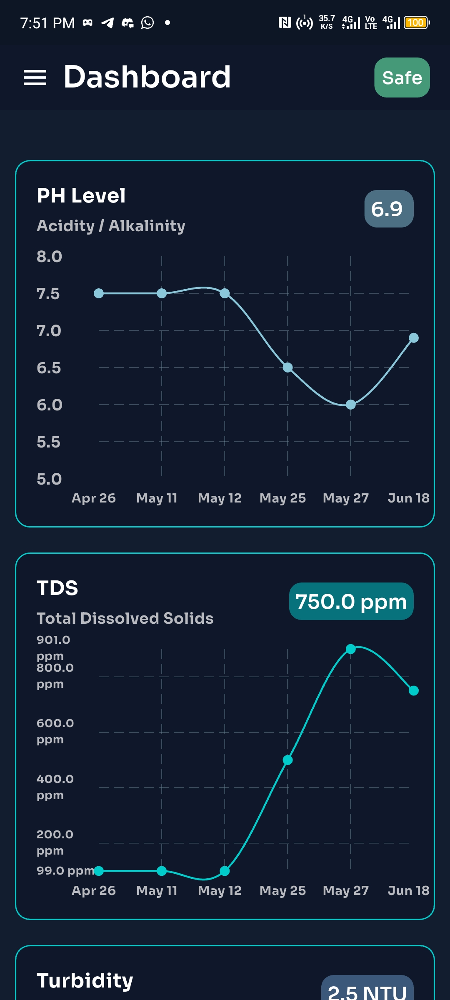
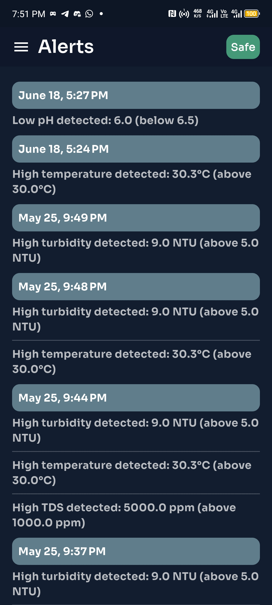

 


# Aquaview – Water Quality Monitoring

Aquaview is a cross-platform Flutter application for monitoring water quality. It leverages Firebase and the [wqms-api](https://github.com/Sylvester-git/wqms-api) for backend services and uses the BLoC pattern for state management. The app is modular, maintainable, and extensible mobile platforms.

## Table of Contents

- [Features](#features)
- [Architecture](#architecture)
- [Project Structure](#project-structure)
- [Getting Started](#getting-started)
  - [Prerequisites](#prerequisites)
  - [Installation](#installation)
- [Configuration](#configuration)
- [State Management](#state-management)
- [Firebase Integration](#firebase-integration)
- [Error Handling](#error-handling)
- [Contributing](#contributing)
- [License](#license)

## Features

- Cross-platform: Web, Windows, Linux, macOS, Android, iOS
- Firebase integration for authentication and data storage
- Modular architecture using the BLoC pattern
- Custom error handling and reporting
- Easily extensible for new features and sensors
- Environment-based configuration via `env.json`

## Architecture

- **Presentation Layer:** UI widgets and screens
- **Business Logic Layer:** BLoC/Cubit classes for state management
- **Data Layer:** Services and repositories for data access (Firebase, APIs)
- **Core/App Layer:** App initialization, dependency injection, configuration

## Project Structure

lib/ main.dart notification_helper.dart app/ app.dart bloc_obserever.dart dependency_inj.dart error_screen.dart init.dart provider.dart config/ api_config.dart config.dart firebase_config.dart features/ controllers/ cubit/ ... network/ util/ assets/ env.json


- `lib/app/`: Core app logic, initialization, dependency injection, error handling.
- `lib/config/`: Configuration files, including API and Firebase config.
- `lib/features/`: Feature modules, controllers, and state management cubits.
- `lib/network/`: Networking utilities and services.
- `lib/util/`: Utility functions and helpers.
- `assets/env.json`: Environment-specific configuration (see below).

## Sample env.json

```json
{
    "BASE_URL": "your-api-baseurl",
    "FIREBASE_API_KEY": "your-firebase-api-key",
    "FIREBASE_PROJECT_ID": "your-firebase-project-id",
    "FIREBASE_STORAGE_BUCKET": "your-firebase-storage-bucket-id",
    "FIREBASE_MESSAGING_SENDER_ID": "your-firebase-messaging-sender-id",
    "FIREBASE_APP_ID": "your-firebase-app-id"
}
```

## Getting Started

### Prerequisites

- [Flutter SDK](https://flutter.dev/docs/get-started/install)
- [Dart SDK](https://dart.dev/get-dart)
- [Firebase Project](https://firebase.google.com/)
- Platform-specific requirements (Android Studio, Xcode, etc.)

### Installation

1. **Clone the repository:**
   ```sh
   git clone https://github.com/yourusername/waterapp.git
   cd waterapp
   ```

2. **Install dependencies:**
    ```sh
    flutter pub get
    ```

3. **Configure environment**
    - Copy the sample `env.json` to the `assets`/ directory and update values as needed.

    - Important: Add `assets/env.json` to your `.gitignore` to avoid committing sensitive data.

### Configuration

The app uses an `env.json` file in the `assets`/ directory for environment-specific settings (API endpoints, keys, etc.).
**Do not commit this file to version control**. Add the following to your `.gitignore`

### State Management

State management is handled using the BLoC pattern. See `lib/app/bloc_obserever.dart` and `lib/features/cubit/` for implementation details.

### Firebase Integration

Firebase is initialized in `lib/main.dart` and configured via `lib/config/firebase_config.dart`.
Ensure you have set up your Firebase project and added the necessary configuration files for each platform.

### Error Handling

Custom error handling is implemented in `lib/app/error_screen.dart` and throughout the app using try/catch and BLoC error observers.

### Contributing

Contributions are welcome! Please open issues and submit pull requests for improvements or bug fixes.

### License

This project is licensed under the MIT License.
